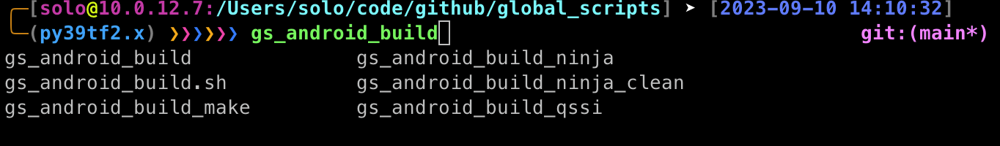
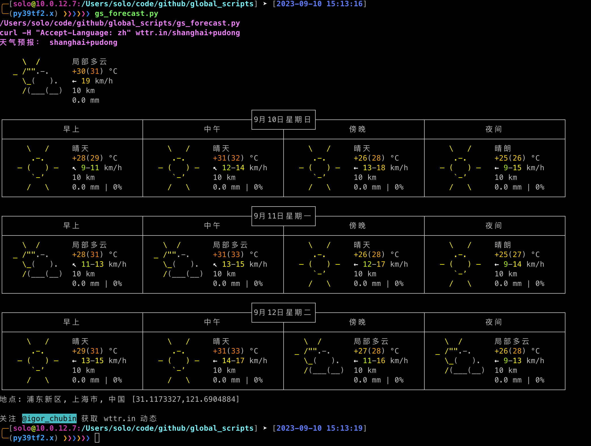

# global scripts

global scripts工程是我在工作、生活中把常用到的命令、脚本等都集合到这个工程中。主要用的能力如：
- zsh 主题、插件
- tmux 主题、插件
- vim 主题、配置
- aosp 编译脚本（超级好用，编译后还自动通知）
- adb push 快捷命令（配合服务器上的编译特别好用）
- adb 命令
- aosp grep 命令（无需lunch）
- frida（android 相关）
- clash（linux 下使用 vpn）
- code style
- git 快捷键
- im bot(企业微信、钉钉、飞书)
- 常用命令 alias
- ...

# 如何使用

在 ~/.bashrc 里 source gs_env.sh 文件即可，比如我的工程目录在/Users/solo/code/github/global_scripts
```bash
source $HOME/code/github/global_scripts/gs_env.sh
```
> source gs_env.sh 要改成其所在的路径


# 配合zsh、oyz使用

如果不想用zsh，就如上只在 ~/.bashrc 中 source gs_env.sh 即可，但建议配合zsh使用更佳。

## 安装zsh

```bash
sudo apt insall zsh

or

brew install zsh
```

## 安装oyz

```bash
sh -c "$(curl -fsSL https://raw.github.com/ohmyzsh/ohmyzsh/master/tools/install.sh)"
```
> https://github.com/ohmyzsh/ohmyzsh

## 配置

在 ~/.zshrc 里source gs_env.sh文件即可，比如我的工程目录在/Users/solo/code/github/global_scripts
```bash
source $HOME/code/github/global_scripts/gs_env.sh
```
> source gs_env.sh 要改成其所在的路径
>
> .zshrc里还配置zsh-autosuggestions 、zsh-syntax-highlighting插件，所以需要下载以下两个工程
> 
> git clone https://github.com/zsh-users/zsh-autosuggestions ${ZSH_CUSTOM:-~/.oh-my-zsh/custom}/plugins/zsh-autosuggestions
> 
> git clone https://github.com/zsh-users/zsh-syntax-highlighting.git ${ZSH_CUSTOM:-~/.oh-my-zsh/custom}/plugins/zsh-syntax-highlighting


# 重要
gs_env.sh文件中，要把 _GS_ROOT_PATH 配置成正确的路径（也就是你下载global_scripts工程的路径）
```bash
_GS_ROOT_PATH="$HOME/code/github/global_scripts"
```

# 脚本能力

## gs_android_build.sh

android源码编译快捷键命令，如全编、ninja单编等。


> 暂时用到这些命令，后续有常用的再补充

```bash
╭─[solo@10.0.12.7] ➤ [/Users/solo/code/8450] ➤ [2023-09-10 14:16:42]
╰─(Ppy39tf2.x) ❯❯❯❯❯❯ gs_android_build_ninja
Trying dependencies-only mode on a non-existing device tree?

1. framework
2. framework-minus-apex
3. services
4. libandroid_servers
5. libinputflinger
6. libinputdispatcher
7. libinputreader
8. selinux_policy
9. surfaceflinger
10. update_engine
11. android.hardware.power-service
12. libresourcemanagerservice
13. libaudioflinger
14. libcameraservice
15. com.journeyOS.J007engine.hidl@1.0-service
16. com.journeyOS.J007engine.hidl@1.0
17. J007Service
18. jos-framework
19. jos-services
20. watermark
Which would you like? [ framework ]
```

## gs_android_grep.sh

android源码目录下grep快速查找代码
```bash
╭─[solo@10.0.12.7:/Users/solo/code/github/global_scripts] ➤ [2023-09-10 14:18:29]
╰─(py39tf2.x) ❯❯❯❯❯❯ gs_aosp_help
- gs_aosp_cgrep:      Greps on all local C/C++ files.
- gs_aosp_ggrep:      Greps on all local Gradle files.
- gs_aosp_gogrep:     Greps on all local Go files.
- gs_aosp_jgrep:      Greps on all local Java files.
- gs_aosp_ktgrep:     Greps on all local Kotlin files.
- gs_aosp_resgrep:    Greps on all local res/*.xml files.
- gs_aosp_mangrep:    Greps on all local AndroidManifest.xml files.
- gs_aosp_mgrep:      Greps on all local Makefiles and *.bp files.
- gs_aosp_owngrep:    Greps on all local OWNERS files.
- gs_aosp_rsgrep:     Greps on all local Rust files.
- gs_aosp_sepgrep:    Greps on all local sepolicy files.
- gs_aosp_sgrep:      Greps on all local source files.
```


## gs_adb.sh

adb快捷键命令

> 暂时用到这些命令，后续有常用的再补充
```bash
╭─[solo@10.0.12.7:/Users/solo/code/github/global_scripts] ➤ [2023-09-10 14:18:29]
╰─(py39tf2.x) ❯❯❯❯❯❯ gs_adb_
gs_adb_abx2xml                gs_adb_key_back
gs_adb_clear_package          gs_adb_key_home
gs_adb_dump_version           gs_adb_key_menu
gs_adb_dump_version_settings  gs_adb_kill_grep
gs_adb_hidden_api_disable     gs_adb_kill_package
gs_adb_hidden_api_enable      gs_adb_log_grep
gs_adb_i007service_clear      gs_adb_ps_grep
gs_adb_i007service_kill       gs_adb_rm_dex2oat
gs_adb_i007service_log        gs_adb_screencap
gs_adb_i007service_version    gs_adb_screenrecord
gs_adb_imei                   gs_adb_selinux_disable
gs_adb_input_disable          gs_adb_settings_provider
gs_adb_input_enable           gs_adb_sf_dump_refresh_rate
gs_adb_j007engine_kill        gs_adb_sf_set_refresh_rate
gs_adb_j007engine_log         gs_adb_sf_show_refresh_rate
gs_adb_j007service_clear      gs_adb_show_3rd_app
gs_adb_j007service_kill       gs_adb_show_log
gs_adb_j007service_log        gs_adb_show_system_app
gs_adb_j007service_version    gs_adb_shutdown_emulator
gs_adb_key                    gs_adb_systrace
```

## gs_android_push.sh

```bash
╭─[solo@10.0.12.7:/Users/solo/code/github/global_scripts] ➤ [2023-09-10 14:19:45]
╰─(py39tf2.x) ❯❯❯❯❯❯ gs_android_push_
gs_android_push_args            gs_android_push_mediaserver
gs_android_push_ext_framework   gs_android_push_services
gs_android_push_ext_services    gs_android_push_settings
gs_android_push_flyme_services  gs_android_push_so
gs_android_push_framework       gs_android_push_surfaceflinger
gs_android_push_framework_jni   gs_android_push_systemui
gs_android_push_input
```

## zsh自定义主题

- 用户名
- ip地址
- 当前目录绝对路径
- 当前时间
- git信息（分支、是否修改等）
- bash环境 还是 zsh环境；py环境


> zsh环境并且当前目录是git仓才显示git信息。


## gerrit提交脚本

如果是提交代码到gerrit，在终端执行gerrit.py -b branch。不输入分支信息则默认master分支。

## frida

最初的时候我是"不屑于"用 frida 的，觉得系统开发人员随时可以通过该代码验证，何必用 frida 呢。

一次偶然的机会，使用 frida hook 了某个函数，就喜欢用上了，而且一发不可收。

如果你需要编译代码，编译慢不说，不同的产品的bug需要编译的jar、apex都不一样；那你服务器是不是得准备很多套 android 源码。这就要求你服务器容量要大。
所以 frida 的优势就来了，无需编译代码，hook 就行了。

对于辅助 debug 非常有用。

> frida 具体的用法以及能力请自行查看代码。 

## clash

linux 系统下使用命令启用 clash。

## codestyle

codestyle检查，支持Java代码或者kotlin代码。
执行 gs_check_style.py --style "strict_mode"
其中 strict_mode 可以为
```bash
alibaba
google
strict_mode
sun
test
work
```
> 可以根据自己的需求修改codestyle

## tmux 主题、插件

自行查看代码。

## 查询天气脚本




## git 快捷命令
```bash
a = add
b = branch
c = commit
d = diff
f = fetch
g = grep
l = log
m = merge
o = checkout
p = pull
r = remote
s = status
w = whatchanged

ap = add --patch
be = branch --edit-description
ci = commit --interactive
ds = diff --staged
lg = log --graph
ss = status --short
```

## vim
轻量级 Vim 配置框架，全中文注释。

### 基础配置
- init.vim: 配置入口，设置 runtimepath 检测脚本路径，加载其他脚本。
- tiny文件夹: 所有人都能同意的基础配置（无任何按键和样式定义）。
- fileconfig.vim: 文件相关的配置。
- keymaps.vim: 快捷键定义。
- style.vim: 状态栏，更紧凑的标签栏文字等和显示相关。
- tabsize.vim: 制表符宽度，是否展开空格等，因为个人差异太大，单独一个文件好更改。
- terminal.vim: 终端相关配置。
- theme.vim: 色彩主题，高亮优化(mac系统下打开此功能)。
- tmux.vim: tmux相关配置。

### 色彩配置
颜色配置：在colors目录（都是网上下载的配置），下载后在theme.vim更新颜色主题即可。


## other

- gs_common_alias.sh : 常用的alias
- gs_private_alias.sh : 私人的一些alias
