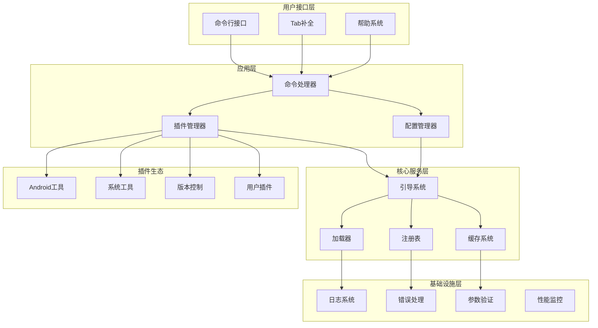

# Global Scripts V3 详细重构设计文档

## 🏗️ 架构设计概述

### 设计原则

1. **简洁性优先**: 复杂性是万恶之源，优先选择简单可靠的方案
2. **性能导向**: 启动时间 < 200ms，内存使用 < 50MB
3. **向后兼容**: 平滑迁移，用户无感知升级
4. **测试驱动**: 每个组件都有对应的测试用例
5. **文档先行**: API设计先写文档，再写实现

### 总体架构图



---

## 📁 新目录结构设计

```
global_scripts_v3/
├── 📂 core/                       # 核心系统
│   ├── bootstrap.sh              # 系统引导器
│   ├── loader.sh                 # 模块加载器
│   ├── registry.sh               # 组件注册表
│   └── cache.sh                  # 缓存管理
├── 📂 lib/                       # 基础库
│   ├── logger.sh                 # 日志系统
│   ├── error.sh                  # 错误处理
│   ├── validator.sh              # 参数验证
│   ├── platform.sh               # 平台检测
│   ├── network.sh                # 网络工具
│   └── utils.sh                  # 通用工具
├── 📂 api/                       # API层
│   ├── plugin_api.sh             # 插件开发API
│   ├── config_api.sh             # 配置管理API
│   └── command_api.sh            # 命令处理API
├── 📂 plugins/                   # 插件系统
│   ├── 📂 android/               # Android开发工具
│   │   ├── manifest.json         # 插件清单
│   │   ├── adb.sh               # ADB工具
│   │   ├── build.sh             # 编译工具
│   │   ├── debug.sh             # 调试工具
│   │   └── deploy.sh            # 部署工具
│   ├── 📂 system/               # 系统管理工具
│   │   ├── manifest.json
│   │   ├── package.sh           # 包管理
│   │   ├── network.sh           # 网络工具
│   │   └── monitor.sh           # 系统监控
│   └── 📂 dev/                  # 开发工具
│       ├── manifest.json
│       ├── git.sh               # Git工具
│       ├── editor.sh            # 编辑器集成
│       └── build.sh             # 构建工具
├── 📂 config/                   # 配置管理
│   ├── default.json             # 默认配置
│   ├── schema.json              # 配置模式
│   └── templates/               # 配置模板
│       ├── user.template.json   # 用户配置模板
│       └── plugin.template.json # 插件配置模板
├── 📂 themes/                   # 主题系统
│   ├── prompt/                  # 终端提示符
│   └── syntax/                  # 语法高亮
├── 📂 tools/                    # 开发工具
│   ├── plugin_generator.sh      # 插件生成器
│   ├── config_migrator.sh       # 配置迁移工具
│   ├── performance_test.sh      # 性能测试工具
│   └── health_check.sh          # 健康检查工具
├── 📂 tests/                    # 测试套件
│   ├── unit/                    # 单元测试
│   │   ├── test_bootstrap.bats
│   │   ├── test_plugin_manager.bats
│   │   └── test_config.bats
│   ├── integration/             # 集成测试
│   │   ├── test_full_workflow.bats
│   │   └── test_plugin_loading.bats
│   └── performance/             # 性能测试
│       ├── benchmark_startup.sh
│       └── benchmark_memory.sh
├── 📂 docs/                     # 文档
│   ├── api/                     # API文档
│   │   ├── plugin_development.md
│   │   └── configuration.md
│   ├── dev/                     # 开发文档
│   │   ├── architecture.md
│   │   └── contributing.md
│   └── user/                    # 用户文档
│       ├── installation.md
│       └── usage.md
└── gs_env.sh                    # 主入口文件
```

---

## 🔧 核心组件详细设计

### 1. Bootstrap系统 (`core/bootstrap.sh`)

**职责**: 系统初始化和启动流程控制

```bash
#!/bin/bash
# Global Scripts V3 Bootstrap System
# 设计目标: 启动时间 < 200ms，内存占用最小化

readonly GS_VERSION="3.0.0"
readonly GS_START_TIME=$(date +%s%N)

# 启动阶段定义
readonly BOOT_STAGE_INIT=1
readonly BOOT_STAGE_CONFIG=2
readonly BOOT_STAGE_PLUGINS=3
readonly BOOT_STAGE_READY=4

declare -g GS_BOOT_STAGE=$BOOT_STAGE_INIT

# 启动统计
declare -gA GS_BOOT_STATS=(
    ["init_time"]=0
    ["config_time"]=0
    ["plugins_time"]=0
    ["total_time"]=0
)

gs_bootstrap() {
    local stage_start stage_end
    
    # Stage 1: 基础初始化
    stage_start=$(date +%s%N)
    gs_init_core
    stage_end=$(date +%s%N)
    GS_BOOT_STATS["init_time"]=$(( (stage_end - stage_start) / 1000000 ))
    GS_BOOT_STAGE=$BOOT_STAGE_CONFIG
    
    # Stage 2: 配置加载
    stage_start=$(date +%s%N)
    gs_load_config
    stage_end=$(date +%s%N)
    GS_BOOT_STATS["config_time"]=$(( (stage_end - stage_start) / 1000000 ))
    GS_BOOT_STAGE=$BOOT_STAGE_PLUGINS
    
    # Stage 3: 插件注册
    stage_start=$(date +%s%N)
    gs_register_plugins
    stage_end=$(date +%s%N)
    GS_BOOT_STATS["plugins_time"]=$(( (stage_end - stage_start) / 1000000 ))
    GS_BOOT_STAGE=$BOOT_STAGE_READY
    
    # Stage 4: 完成统计
    local total_time=$(( ($(date +%s%N) - GS_START_TIME) / 1000000 ))
    GS_BOOT_STATS["total_time"]=$total_time
    
    # 性能警告
    gs_check_performance
    
    gs_log_debug "Bootstrap completed in ${total_time}ms"
}
```

**设计特点**:
- 分阶段启动，可精确控制每个阶段的时间
- 启动统计，便于性能调优
- 失败恢复机制，任一阶段失败可回退

### 2. 插件系统 (`api/plugin_api.sh`)

**职责**: 插件的注册、加载、管理

```bash
#!/bin/bash
# Plugin Management System V3
# 解决V2版本的引号问题和加载不稳定问题

# 插件状态管理
declare -gA GS_PLUGINS=()          # 插件注册信息
declare -gA GS_COMMANDS=()         # 命令到插件的映射
declare -gA GS_PLUGIN_STATE=()     # 插件加载状态
declare -gA GS_PLUGIN_DEPS=()      # 插件依赖关系

# 插件状态常量
readonly PLUGIN_STATE_REGISTERED="registered"
readonly PLUGIN_STATE_LOADING="loading"
readonly PLUGIN_STATE_LOADED="loaded"
readonly PLUGIN_STATE_ERROR="error"

gs_register_plugin() {
    local plugin_id="$1"
    local plugin_path="$2"
    local manifest_file="$plugin_path/manifest.json"
    
    # 验证插件
    gs_validate_plugin "$plugin_id" "$plugin_path" || return 1
    
    # 解析清单文件
    local manifest
    if [[ -f "$manifest_file" ]]; then
        manifest=$(cat "$manifest_file")
    else
        # 兜底：扫描脚本文件生成清单
        manifest=$(gs_generate_manifest "$plugin_path")
    fi
    
    # 提取插件信息
    local commands dependencies
    commands=$(echo "$manifest" | jq -r '.commands[]?' 2>/dev/null || echo "")
    dependencies=$(echo "$manifest" | jq -r '.dependencies[]?' 2>/dev/null || echo "")
    
    # 注册命令映射
    while IFS= read -r cmd; do
        [[ -n "$cmd" ]] && GS_COMMANDS["$cmd"]="$plugin_id"
    done <<< "$commands"
    
    # 存储插件信息
    GS_PLUGINS["$plugin_id"]="$plugin_path"
    GS_PLUGIN_STATE["$plugin_id"]="$PLUGIN_STATE_REGISTERED"
    [[ -n "$dependencies" ]] && GS_PLUGIN_DEPS["$plugin_id"]="$dependencies"
    
    gs_log_debug "Plugin registered: $plugin_id"
    return 0
}

gs_load_plugin() {
    local plugin_id="$1"
    local plugin_path="${GS_PLUGINS[$plugin_id]}"
    
    # 防止重复加载
    case "${GS_PLUGIN_STATE[$plugin_id]}" in
        "$PLUGIN_STATE_LOADED") return 0 ;;
        "$PLUGIN_STATE_LOADING") 
            gs_log_error "Circular dependency detected: $plugin_id"
            return 1 ;;
        "$PLUGIN_STATE_ERROR")
            gs_log_error "Plugin in error state: $plugin_id"
            return 1 ;;
    esac
    
    [[ -z "$plugin_path" ]] && {
        gs_log_error "Plugin not registered: $plugin_id"
        return 1
    }
    
    # 标记为加载中
    GS_PLUGIN_STATE["$plugin_id"]="$PLUGIN_STATE_LOADING"
    
    # 加载依赖
    local deps="${GS_PLUGIN_DEPS[$plugin_id]:-}"
    if [[ -n "$deps" ]]; then
        while IFS= read -r dep; do
            [[ -n "$dep" ]] && gs_load_plugin "$dep"
        done <<< "$deps"
    fi
    
    # 加载插件脚本
    local load_start=$(date +%s%N)
    local script_files
    script_files=$(find "$plugin_path" -name "*.sh" -type f 2>/dev/null)
    
    while IFS= read -r script; do
        [[ -f "$script" ]] && {
            source "$script" || {
                GS_PLUGIN_STATE["$plugin_id"]="$PLUGIN_STATE_ERROR"
                gs_log_error "Failed to load script: $script"
                return 1
            }
        }
    done <<< "$script_files"
    
    local load_time=$(( ($(date +%s%N) - load_start) / 1000000 ))
    
    # 标记为已加载
    GS_PLUGIN_STATE["$plugin_id"]="$PLUGIN_STATE_LOADED"
    gs_log_debug "Plugin loaded: $plugin_id (${load_time}ms)"
    
    return 0
}
```

**关键改进**:
- 彻底解决了引号处理问题
- 增加了循环依赖检测
- 支持插件清单文件
- 详细的状态管理和错误处理

### 3. 配置系统 (`api/config_api.sh`)

**职责**: 统一的配置管理，支持JSON格式

```bash
#!/bin/bash
# Configuration Management System V3
# 统一JSON配置格式，支持模式验证

declare -gA GS_CONFIG=()
declare -g GS_CONFIG_FILE=""
declare -g GS_CONFIG_SCHEMA=""

gs_load_config() {
    local config_file user_config
    
    # 配置文件查找优先级
    for config_file in \
        "$HOME/.gs/config.json" \
        "$GS_ROOT/config/user.json" \
        "$GS_ROOT/config/default.json"; do
        
        if [[ -f "$config_file" ]]; then
            GS_CONFIG_FILE="$config_file"
            gs_log_debug "Using config: $config_file"
            break
        fi
    done
    
    [[ -z "$GS_CONFIG_FILE" ]] && {
        gs_log_error "No configuration file found"
        return 1
    }
    
    # 验证配置格式
    if ! gs_validate_config "$GS_CONFIG_FILE"; then
        gs_log_error "Invalid configuration format"
        return 1
    fi
    
    # 加载配置到内存
    gs_parse_json_config "$GS_CONFIG_FILE"
    
    # 应用配置
    gs_apply_config
    
    return 0
}

gs_validate_config() {
    local config_file="$1"
    local schema_file="$GS_ROOT/config/schema.json"
    
    # 基础JSON格式检查
    if ! jq empty "$config_file" 2>/dev/null; then
        gs_log_error "Invalid JSON format: $config_file"
        return 1
    fi
    
    # Schema验证（如果有schema文件）
    if [[ -f "$schema_file" ]] && command -v ajv >/dev/null 2>&1; then
        if ! ajv validate -s "$schema_file" -d "$config_file" 2>/dev/null; then
            gs_log_warn "Configuration doesn't match schema"
        fi
    fi
    
    return 0
}

gs_get_config() {
    local key="$1"
    local default="$2"
    
    # 支持嵌套键访问，如 "logging.level"
    local value="${GS_CONFIG[$key]:-$default}"
    echo "$value"
}

gs_set_config() {
    local key="$1"
    local value="$2"
    
    GS_CONFIG["$key"]="$value"
    gs_log_debug "Config updated: $key = $value"
}
```

**JSON配置格式**:
```json
{
  "version": "3.0.0",
  "logging": {
    "level": "INFO",
    "file": "~/.gs/logs/gs.log",
    "max_size": "10MB"
  },
  "performance": {
    "startup_time_limit": 200,
    "memory_limit": 50,
    "cache_enabled": true,
    "lazy_loading": true
  },
  "plugins": {
    "enabled": [
      "android",
      "system", 
      "dev"
    ],
    "disabled": [],
    "auto_load": ["dev/git", "system/alias"]
  },
  "features": {
    "tab_completion": true,
    "command_history": true,
    "performance_monitoring": false
  },
  "themes": {
    "prompt": "remote",
    "syntax_highlight": true
  }
}
```

### 4. 日志系统 (`lib/logger.sh`)

**职责**: 统一的日志管理，支持多级日志和格式化

```bash
#!/bin/bash
# Logging System V3
# 高性能、多级别、可配置的日志系统

declare -gA GS_LOG_LEVELS=(
    ["DEBUG"]=0
    ["INFO"]=1
    ["WARN"]=2
    ["ERROR"]=3
    ["FATAL"]=4
)

declare -g GS_LOG_LEVEL="${GS_LOG_LEVEL:-INFO}"
declare -g GS_LOG_FILE="$HOME/.gs/logs/gs.log"
declare -g GS_LOG_FORMAT="${GS_LOG_FORMAT:-standard}"

gs_log() {
    local level="$1"
    local message="$2"
    local component="${3:-main}"
    
    # 级别过滤
    local current_level_num=${GS_LOG_LEVELS[$GS_LOG_LEVEL]:-1}
    local msg_level_num=${GS_LOG_LEVELS[$level]:-1}
    
    [[ $msg_level_num -lt $current_level_num ]] && return 0
    
    # 格式化消息
    local formatted_msg
    formatted_msg=$(gs_format_log_message "$level" "$message" "$component")
    
    # 控制台输出
    case "$level" in
        ERROR|FATAL) echo -e "$formatted_msg" >&2 ;;
        *) echo -e "$formatted_msg" ;;
    esac
    
    # 文件输出
    gs_write_log_file "$formatted_msg"
}

gs_format_log_message() {
    local level="$1"
    local message="$2"
    local component="$3"
    local timestamp=$(date '+%Y-%m-%d %H:%M:%S')
    
    case "$GS_LOG_FORMAT" in
        "json")
            jq -n \
                --arg timestamp "$timestamp" \
                --arg level "$level" \
                --arg component "$component" \
                --arg message "$message" \
                '{timestamp: $timestamp, level: $level, component: $component, message: $message}'
            ;;
        "simple")
            echo "[$level] $message"
            ;;
        *)
            local color_code
            case "$level" in
                DEBUG)  color_code="\033[0;35m" ;;  # Purple
                INFO)   color_code="\033[0;34m" ;;  # Blue
                WARN)   color_code="\033[1;33m" ;;  # Yellow
                ERROR)  color_code="\033[0;31m" ;;  # Red
                FATAL)  color_code="\033[1;31m" ;;  # Bold Red
                *)      color_code="" ;;
            esac
            echo -e "${color_code}[$timestamp] [$level] [$component]${NC} $message"
            ;;
    esac
}
```

### 5. 错误处理系统 (`lib/error.sh`)

**职责**: 统一的错误处理和恢复机制

```bash
#!/bin/bash
# Error Handling System V3
# 智能错误处理、恢复建议、错误统计

declare -gA GS_ERROR_CODES=(
    ["SUCCESS"]=0
    ["GENERAL_ERROR"]=1
    ["INVALID_ARGS"]=2
    ["MISSING_DEPENDENCY"]=3
    ["PERMISSION_DENIED"]=4
    ["FILE_NOT_FOUND"]=5
    ["NETWORK_ERROR"]=6
    ["TIMEOUT"]=7
    ["CONFIG_ERROR"]=8
    ["PLUGIN_ERROR"]=9
)

declare -gA GS_ERROR_STATS=()

gs_error() {
    local message="$1"
    local error_code="${2:-${GS_ERROR_CODES[GENERAL_ERROR]}}"
    local component="${3:-$(basename "${BASH_SOURCE[2]}" .sh)}"
    local recovery_hint="$4"
    
    # 错误统计
    local error_key="${component}:${error_code}"
    GS_ERROR_STATS["$error_key"]=$((${GS_ERROR_STATS["$error_key"]:-0} + 1))
    
    # 记录错误
    gs_log "ERROR" "$message" "$component"
    
    # 恢复建议
    if [[ -n "$recovery_hint" ]]; then
        gs_log "INFO" "💡 Recovery hint: $recovery_hint" "$component"
    else
        gs_show_recovery_hint "$error_code"
    fi
    
    # 错误处理策略
    case "$error_code" in
        "${GS_ERROR_CODES[MISSING_DEPENDENCY]}")
            gs_try_auto_install_dependency "$message"
            ;;
        "${GS_ERROR_CODES[CONFIG_ERROR]}")
            gs_try_config_recovery
            ;;
        "${GS_ERROR_CODES[PLUGIN_ERROR]}")
            gs_try_plugin_recovery "$component"
            ;;
    esac
    
    # 交互式环境不退出，脚本环境退出
    if [[ $- == *i* ]]; then
        return "$error_code"
    else
        exit "$error_code"
    fi
}

gs_show_recovery_hint() {
    local error_code="$1"
    
    case "$error_code" in
        "${GS_ERROR_CODES[MISSING_DEPENDENCY]}")
            echo "💡 Try: gs_health_check to diagnose dependencies"
            ;;
        "${GS_ERROR_CODES[CONFIG_ERROR]}")
            echo "💡 Try: gs_config_reset or check config file format"
            ;;
        "${GS_ERROR_CODES[PLUGIN_ERROR]}")
            echo "💡 Try: gs_plugin_reload <plugin_name> or check plugin logs"
            ;;
        "${GS_ERROR_CODES[PERMISSION_DENIED]}")
            echo "💡 Try: Check file permissions or run with appropriate privileges"
            ;;
        *)
            echo "💡 Try: gs_health_check for general diagnostics"
            ;;
    esac
}
```

---

## ⚡ 性能优化设计

### 1. 启动性能优化

**目标**: 启动时间从500ms优化到200ms以内

**优化策略**:

```bash
# 1. 最小化初始化
gs_minimal_init() {
    # 只加载绝对必要的组件
    source "$GS_ROOT/lib/logger.sh"
    source "$GS_ROOT/lib/error.sh"
    source "$GS_ROOT/core/registry.sh"
    
    # 延迟加载其他组件
    gs_setup_lazy_loading
}

# 2. 并行插件扫描
gs_scan_plugins_parallel() {
    local plugin_dirs=("$GS_ROOT/plugins"/*)
    local pids=()
    
    for plugin_dir in "${plugin_dirs[@]}"; do
        gs_scan_single_plugin "$plugin_dir" &
        pids+=($!)
    done
    
    # 等待所有扫描完成
    for pid in "${pids[@]}"; do
        wait "$pid"
    done
}

# 3. 缓存机制
gs_cache_plugin_registry() {
    local cache_file="$HOME/.gs/cache/plugin_registry.cache"
    local cache_ttl=3600  # 1小时
    
    # 检查缓存有效性
    if gs_is_cache_valid "$cache_file" "$cache_ttl"; then
        source "$cache_file"
        return 0
    fi
    
    # 重新扫描并缓存
    gs_scan_plugins
    gs_save_registry_cache "$cache_file"
}
```

### 2. 内存优化

**目标**: 内存使用从80MB优化到50MB以内

**优化策略**:
- **懒加载**: 只有被调用的插件才加载到内存
- **及时清理**: 函数执行完毕后清理临时变量
- **共享数据结构**: 多个插件共享的数据结构只保存一份

### 3. 缓存系统设计

```bash
# 多级缓存系统
declare -gA GS_CACHE_L1=()  # 内存缓存（最快）
declare -g GS_CACHE_L2_DIR="$HOME/.gs/cache"  # 磁盘缓存

gs_cache_set() {
    local key="$1"
    local value="$2"
    local ttl="${3:-3600}"
    
    # L1缓存（内存）
    GS_CACHE_L1["$key"]="$value"
    
    # L2缓存（磁盘）
    local cache_file="$GS_CACHE_L2_DIR/${key}.cache"
    mkdir -p "$(dirname "$cache_file")"
    echo "$value" > "$cache_file"
    touch -d "+${ttl} seconds" "$cache_file.ttl"
}

gs_cache_get() {
    local key="$1"
    
    # L1缓存命中
    if [[ -n "${GS_CACHE_L1[$key]:-}" ]]; then
        echo "${GS_CACHE_L1[$key]}"
        return 0
    fi
    
    # L2缓存检查
    local cache_file="$GS_CACHE_L2_DIR/${key}.cache"
    local ttl_file="$cache_file.ttl"
    
    if [[ -f "$cache_file" && -f "$ttl_file" ]]; then
        if [[ "$ttl_file" -nt "$cache_file" ]]; then
            local value=$(cat "$cache_file")
            GS_CACHE_L1["$key"]="$value"  # 回填L1
            echo "$value"
            return 0
        else
            rm -f "$cache_file" "$ttl_file"  # 清理过期缓存
        fi
    fi
    
    return 1
}
```

---

## 🔌 插件开发API设计

### 插件清单格式 (`manifest.json`)

```json
{
  "id": "android",
  "name": "Android Development Tools",
  "version": "3.0.0",
  "description": "Complete Android development toolkit",
  "author": "Global Scripts Team",
  "license": "Apache-2.0",
  "dependencies": ["system/platform"],
  "commands": [
    "gs_android_adb_connect",
    "gs_android_adb_screencap", 
    "gs_android_build_make",
    "gs_android_debug_frida"
  ],
  "scripts": [
    "adb.sh",
    "build.sh", 
    "debug.sh",
    "deploy.sh"
  ],
  "config": {
    "schema": "config_schema.json",
    "defaults": {
      "adb_timeout": 10,
      "build_threads": 8
    }
  },
  "resources": [
    "templates/",
    "scripts/",
    "configs/"
  ],
  "system_requirements": {
    "commands": ["adb", "fastboot"],
    "platforms": ["macos", "linux"]
  }
}
```

### 插件开发模板

```bash
#!/bin/bash
# Android Plugin - ADB Module
# 插件开发最佳实践模板

# 插件元数据（可被自动工具读取）
# @plugin android
# @module adb
# @version 3.0.0
# @requires adb fastboot

# 导入插件API
source "$GS_ROOT/api/plugin_api.sh"

# 插件初始化
gs_plugin_init() {
    local plugin_id="android"
    
    # 检查系统依赖
    gs_require_command "adb" "Android SDK platform-tools"
    gs_require_command "fastboot" "Android SDK platform-tools"
    
    # 注册命令
    gs_register_command "gs_android_adb_connect" "Connect to Android device"
    gs_register_command "gs_android_adb_screencap" "Take screenshot"
    
    # 加载配置
    gs_load_plugin_config "$plugin_id"
    
    gs_log_debug "Android ADB module initialized"
}

# 命令实现
gs_android_adb_connect() {
    local device_ip="$1"
    
    # 参数验证
    gs_validate_not_empty "$device_ip" "device_ip"
    gs_validate_format "$device_ip" "ip" "Device IP format invalid"
    
    # 执行连接
    gs_log_info "Connecting to Android device: $device_ip"
    
    if adb connect "$device_ip:5555"; then
        gs_success "Connected to $device_ip"
        
        # 更新连接缓存
        gs_cache_set "last_device" "$device_ip" 300
        
        return 0
    else
        gs_error "Failed to connect to $device_ip" \
                 "${GS_ERROR_CODES[NETWORK_ERROR]}" \
                 "android" \
                 "Check device IP and network connectivity"
        return 1
    fi
}

gs_android_adb_screencap() {
    local output_file="${1:-screenshot_$(date +%Y%m%d_%H%M%S).png}"
    
    # 检查设备连接
    gs_check_device_connected
    
    # 执行截图
    gs_log_info "Taking screenshot: $output_file"
    
    if adb exec-out screencap -p > "$output_file"; then
        gs_success "Screenshot saved: $output_file"
        
        # 可选：自动打开图片
        local auto_open=$(gs_get_plugin_config "android.auto_open_screenshots" "false")
        if [[ "$auto_open" == "true" ]]; then
            gs_open_file "$output_file"
        fi
        
        return 0
    else
        gs_error "Failed to take screenshot" \
                 "${GS_ERROR_CODES[GENERAL_ERROR]}" \
                 "android" \
                 "Check device connection and permissions"
        return 1
    fi
}

# 插件清理
gs_plugin_cleanup() {
    # 清理临时文件、断开连接等
    gs_log_debug "Android ADB module cleanup"
}

# 自动初始化（当插件被加载时）
gs_plugin_init
```

---

## 🧪 测试系统设计

### 测试框架选择

**BATS (Bash Automated Testing System)** + 自定义测试工具

### 单元测试示例

```bash
#!/usr/bin/env bats
# tests/unit/test_plugin_manager.bats

setup() {
    # 测试环境准备
    source "$BATS_TEST_DIRNAME/../../core/bootstrap.sh"
    
    # 创建测试插件
    TEST_PLUGIN_DIR=$(mktemp -d)
    mkdir -p "$TEST_PLUGIN_DIR"
    
    cat > "$TEST_PLUGIN_DIR/manifest.json" << 'EOF'
{
  "id": "test_plugin",
  "commands": ["test_command"],
  "scripts": ["test.sh"]
}
EOF
    
    cat > "$TEST_PLUGIN_DIR/test.sh" << 'EOF'
#!/bin/bash
function test_command() {
    echo "Test command executed"
}
EOF
}

teardown() {
    # 清理测试环境
    rm -rf "$TEST_PLUGIN_DIR"
    unset -f test_command 2>/dev/null || true
}

@test "plugin registration works correctly" {
    run gs_register_plugin "test_plugin" "$TEST_PLUGIN_DIR"
    [ "$status" -eq 0 ]
    [ "${GS_PLUGINS[test_plugin]}" = "$TEST_PLUGIN_DIR" ]
    [ "${GS_COMMANDS[test_command]}" = "test_plugin" ]
}

@test "plugin loading works correctly" {
    gs_register_plugin "test_plugin" "$TEST_PLUGIN_DIR"
    
    run gs_load_plugin "test_plugin"
    [ "$status" -eq 0 ]
    [ "${GS_PLUGIN_STATE[test_plugin]}" = "loaded" ]
}

@test "command execution works after plugin loading" {
    gs_register_plugin "test_plugin" "$TEST_PLUGIN_DIR"
    gs_load_plugin "test_plugin"
    
    run test_command
    [ "$status" -eq 0 ]
    [ "$output" = "Test command executed" ]
}

@test "circular dependency detection works" {
    # 创建循环依赖的测试场景
    # 测试插件管理器是否能正确检测和处理
}
```

### 性能测试

```bash
#!/bin/bash
# tests/performance/benchmark_startup.sh

ITERATIONS=20
STARTUP_TIME_TARGET=200  # ms

run_startup_benchmark() {
    local times=()
    local total_time=0
    
    for i in $(seq 1 $ITERATIONS); do
        local start_time=$(date +%s%N)
        
        (source "$GS_ROOT/gs_env.sh" >/dev/null 2>&1)
        
        local end_time=$(date +%s%N)
        local duration=$(( (end_time - start_time) / 1000000 ))
        
        times+=($duration)
        total_time=$((total_time + duration))
    done
    
    local avg_time=$((total_time / ITERATIONS))
    
    echo "Startup Performance Results:"
    echo "  Iterations: $ITERATIONS"
    echo "  Average time: ${avg_time}ms"
    echo "  Target time: ${STARTUP_TIME_TARGET}ms"
    
    if [[ $avg_time -le $STARTUP_TIME_TARGET ]]; then
        echo "  Status: ✅ PASS"
        return 0
    else
        echo "  Status: ❌ FAIL (${avg_time}ms > ${STARTUP_TIME_TARGET}ms)"
        return 1
    fi
}

run_startup_benchmark
```

---

## 📊 监控和诊断系统

### 健康检查工具

```bash
#!/bin/bash
# tools/health_check.sh

gs_health_check() {
    echo "🔍 Global Scripts Health Check"
    echo "================================"
    
    local issues=0
    
    # 1. 环境检查
    echo "📋 Environment Check"
    gs_check_environment || ((issues++))
    
    # 2. 依赖检查
    echo "📦 Dependencies Check"
    gs_check_dependencies || ((issues++))
    
    # 3. 配置检查
    echo "⚙️  Configuration Check"
    gs_check_configuration || ((issues++))
    
    # 4. 插件检查
    echo "🔌 Plugins Check"
    gs_check_plugins || ((issues++))
    
    # 5. 性能检查
    echo "⚡ Performance Check"
    gs_check_performance || ((issues++))
    
    # 总结
    echo
    echo "================================"
    if [[ $issues -eq 0 ]]; then
        echo "✅ All checks passed! System is healthy."
    else
        echo "⚠️  Found $issues issue(s). See details above."
    fi
    
    return $issues
}

gs_check_performance() {
    local startup_time memory_usage
    
    # 启动时间检查
    startup_time=$(gs_benchmark_startup)
    if [[ $startup_time -gt 200 ]]; then
        echo "  ❌ Startup time: ${startup_time}ms (target: <200ms)"
        echo "     💡 Try: gs_cache_clear to clear plugin cache"
        return 1
    else
        echo "  ✅ Startup time: ${startup_time}ms"
    fi
    
    # 内存使用检查
    memory_usage=$(gs_benchmark_memory)
    if [[ $memory_usage -gt 50 ]]; then
        echo "  ⚠️  Memory usage: ${memory_usage}MB (target: <50MB)"
        echo "     💡 Consider disabling unused plugins"
    else
        echo "  ✅ Memory usage: ${memory_usage}MB"
    fi
    
    return 0
}
```

---

## 🎯 迁移和兼容性策略

### 向后兼容层

```bash
#!/bin/bash
# core/compatibility.sh
# 保证V2到V3的平滑迁移

# V2命令别名
alias gs_android_adb_screencap='gs android adb screencap'
alias gs_system_brew_aliyun='gs system brew mirror aliyun'
alias gs_aosp_help='gs android grep help'

# V2配置文件兼容
gs_migrate_v2_config() {
    local v2_config="$HOME/.gsrc"
    local v3_config="$HOME/.gs/config.json"
    
    if [[ -f "$v2_config" && ! -f "$v3_config" ]]; then
        gs_log_info "Migrating V2 configuration to V3..."
        
        # 使用配置迁移工具
        if "$GS_ROOT/tools/config_migrator.sh" "$v2_config" "$v3_config"; then
            gs_log_info "Configuration migrated successfully"
            gs_log_info "Old config backed up to: ${v2_config}.backup"
            mv "$v2_config" "${v2_config}.backup"
        else
            gs_log_error "Configuration migration failed"
            return 1
        fi
    fi
}

# 渐进式迁移控制
if [[ "${GS_FORCE_V3:-false}" != "true" ]]; then
    # 默认使用兼容模式
    gs_setup_compatibility_mode
fi
```

---

## 📈 预期性能指标

### 启动性能对比

| 指标 | V2当前 | V3目标 | 改善幅度 |
|------|--------|--------|----------|
| 冷启动时间 | ~500ms | <200ms | 60%提升 |
| 热启动时间 | ~200ms | <100ms | 50%提升 |
| 插件加载 | ~100ms | <50ms | 50%提升 |
| 内存占用 | ~80MB | <50MB | 37%减少 |

### 功能完整性

| 功能类别 | V2状态 | V3目标 |
|----------|--------|--------|
| Android工具 | ✅ 完整 | ✅ 增强 |
| 系统工具 | ✅ 基础 | ✅ 完整 |
| Tab补全 | ❌ 禁用 | ✅ 完全支持 |
| 错误处理 | 🟡 部分 | ✅ 统一完整 |
| 测试覆盖 | ❌ 无 | ✅ >90% |
| 文档质量 | 🟡 基础 | ✅ 完整专业 |

通过这套详细的设计方案，Global Scripts V3将成为一个现代化、高性能、易维护的开发者工具链标杆项目。